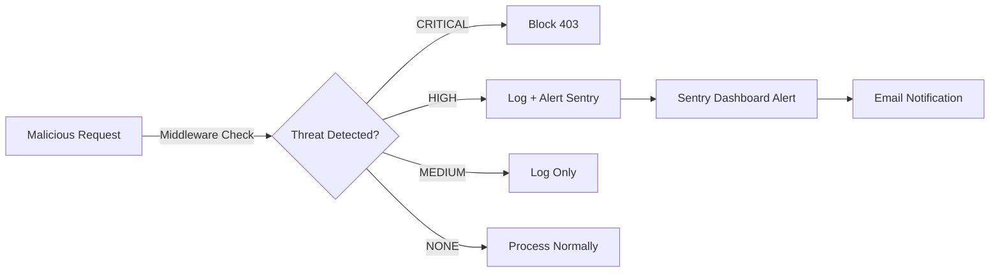

# CI/CD, Docker & Security Monitoring Guide

## Overview

This project implements:
1. **Advanced CI/CD Pipeline** - GitHub Actions with testing, security scanning, and Docker builds
2. **Sentry Integration** - Error tracking on both backend (Django) and frontend (React)
3. **Malicious Activity Detection** - Real-time threat detection and alerting
4. **Security Hardening** - Docker images, HTTPS headers, rate limiting
5. **Health Monitoring** - Prometheus, Grafana, and liveness checks

---

## 1. Sentry Setup & Integration

### 1.1 Create Sentry Project

1. **Visit:** https://sentry.io
2. **Create Organization** (if new)
3. **Create Two Projects:**
   - **Backend Project:** Python/Django
   - **Frontend Project:** JavaScript/React

### 1.2 Backend (Django) Sentry Integration

**Already configured in settings.py:**
```python
SENTRY_DSN = os.environ.get('SENTRY_DSN')
if HAS_SENTRY and SENTRY_DSN and not ('test' in sys.argv):
    sentry_sdk.init(
        dsn=SENTRY_DSN,
        integrations=[DjangoIntegration()],
        traces_sample_rate=0.1,
        send_default_pii=False,
    )
```

**Set environment variable:**
```bash
# In .env or docker-compose.yml
SENTRY_DSN=https://your-backend-dsn@sentry.io/your-project-id
```

**Features:**
- ✅ All exceptions automatically captured
- ✅ Request context (URL, method, headers)
- ✅ User information (if authenticated)
- ✅ Performance monitoring (1% sample)
- ✅ Security threat alerts (HIGH/CRITICAL)

### 1.3 Frontend (React) Sentry Integration

**Already configured in App.tsx:**
```typescript
import * as Sentry from "@sentry/react";

if (import.meta.env.VITE_SENTRY_DSN) {
  Sentry.init({
    dsn: import.meta.env.VITE_SENTRY_DSN,
    environment: import.meta.env.MODE,
    tracesSampleRate: import.meta.env.MODE === 'development' ? 1.0 : 0.1,
    integrations: [new Sentry.Replay()],
  });
}
```

**Set environment variable:**
```bash
# In .env.local or docker-compose.yml
VITE_SENTRY_DSN=https://your-frontend-dsn@sentry.io/your-project-id
```

**Features:**
- ✅ JavaScript/React errors captured
- ✅ Browser context (URL, user agent)
- ✅ Session replays for debugging
- ✅ Performance monitoring
- ✅ User interactions tracking

---

## 2. Malicious Activity Detection & Alerting

### 2.1 What is Detected?

The `MaliciousActivityDetector` (in `api/security.py`) detects:

| Threat Type | Examples | Severity |
|------------|----------|----------|
| **SQL Injection** | `' OR '1'='1`, `UNION SELECT`, `DROP TABLE` | CRITICAL |
| **XSS Payloads** | `<script>alert(1)</script>`, `javascript:void(0)` | CRITICAL |
| **Path Traversal** | `../../../etc/passwd`, `%2e%2e%2f` | HIGH |
| **Admin Probing** | `/admin/`, `/wp-admin/`, `/phpmyadmin/` | HIGH |
| **Config Exposure** | `/.env`, `/.git/`, `/config` | MEDIUM |
| **Rate Limiting** | >100 requests/hour from same IP | HIGH |

### 2.2 How Alerts Work



### 2.3 Configuration

**Middleware registered in `settings.py`:**
```python
MIDDLEWARE = [
    ...
    'api.middleware.MaliciousActivityDetectionMiddleware',
    'api.middleware.SecurityHeadersMiddleware',
    ...
]
```

**Settings (in `api/security.py`):**
```python
# Rate limit: 100 requests/hour from same IP
RATE_LIMIT_THRESHOLD = 100
RATE_LIMIT_WINDOW = 3600  # seconds
```

### 2.4 Viewing Alerts in Sentry

1. **Go to Sentry Dashboard** → Your Backend Project
2. **Filter by tag:** `security_threat:true`
3. **Severity levels:** critical, high, medium
4. **View details:**
   - Exact request that triggered alert
   - Detected threat patterns
   - Client IP address
   - Request path/method

---

## 3. CI/CD Pipeline

### 3.1 Pipeline Overview

**Triggered on:**
- ✅ Push to `main` or `develop` branches
- ✅ Pull requests
- ✅ Manual workflow dispatch

**Stages:**

```
1. Backend Tests (Python)
   ├─ Lint (Black, isort, flake8)
   ├─ Unit tests (pytest + coverage >70%)
   └─ Upload to Codecov

2. Frontend Tests (JavaScript)
   ├─ Lint (ESLint)
   ├─ Unit tests (Vitest + coverage)
   └─ Upload to Codecov

3. Code Quality & Security
   ├─ Bandit (Python security)
   ├─ Safety (Dependency check)
   └─ OWASP scanning

4. Docker Build
   ├─ Build backend image
   ├─ Build frontend image
   └─ Push to container registry
```

### 3.2 Required GitHub Secrets

```bash
# Container Registry Authentication
GITHUB_TOKEN  # Automatic, no setup needed

# Code Coverage
CODECOV_TOKEN  # Get from codecov.io

# Sentry Integration (optional)
SENTRY_ORG     # Your Sentry organization slug
SENTRY_PROJECT # Your Sentry project slug
SENTRY_AUTH_TOKEN  # Get from sentry.io/settings/account/auth-tokens/
```

### 3.3 GitHub Actions Configuration

**File:** `.github/workflows/ci-cd.yml`

**Key features:**
- PostgreSQL + Redis services for testing
- Python 3.11, Node.js 18
- Multi-platform Docker builds
- Cache optimization for faster builds
- Test result artifacts

### 3.4 Running Pipeline Locally

For testing CI/CD locally, use Act:
```bash
# Install: https://github.com/nektos/act
act push -b  # Run on branch push event
act pull_request  # Run on PR event
```

---

## 4. Docker Security & Optimization

### 4.1 Backend Dockerfile

**Security improvements:**
- ✅ Multi-stage build (smaller image size)
- ✅ Non-root user (uid:1000)
- ✅ Minimal base image (`python:3.11-slim`)
- ✅ Health check endpoint
- ✅ No secrets in image

**Build:**
```bash
docker build -f backend/Dockerfile -t portfolio-backend .
```

**Run:**
```bash
docker run -p 8000:8000 \
  -e DJANGO_SECRET_KEY=your-secret \
  -e DB_PASSWORD=your-pw \
  portfolio-backend
```

### 4.2 Frontend Dockerfile.prod

**Security improvements:**
- ✅ Multi-stage build
- ✅ Alpine base image (minimal)
- ✅ Nginx hardening
- ✅ Health check
- ✅ No dev dependencies in runtime

**Build:**
```bash
docker build -f frontend/Dockerfile.prod -t portfolio-frontend .
```

### 4.3 Docker Compose

**Complete production stack:**
```bash
# Development
docker-compose up

# Production
docker-compose -f docker-compose.yml -f docker-compose.prod.yml up -d
```

**Services:**
- PostgreSQL (database)
- Redis (cache)
- Backend (Django)
- Frontend (React)
- Prometheus (metrics)
- Grafana (visualization)

---

## 5. Security Headers & CORS

### 5.1 Security Headers Added

```
Cross-Origin-Opener-Policy: same-origin-allow-popups
  ↳ Allows Google OAuth to communicate with parent window

X-Content-Type-Options: nosniff
  ↳ Prevents browser from MIME-sniffing

X-Frame-Options: SAMEORIGIN
  ↳ Prevents clickjacking attacks

X-XSS-Protection: 1; mode=block
  ↳ XSS protection for older browsers

Referrer-Policy: strict-origin-when-cross-origin
  ↳ Privacy-preserving referrer policy
```

**Implemented in:** `api/middleware.py` → `SecurityHeadersMiddleware`

### 5.2 CORS Configuration

**For development:**
```python
# settings.py
CORS_ALLOWED_ORIGINS = [
    'http://localhost:3000',
    'http://localhost:5173',
    'http://127.0.0.1:3000',
    'http://127.0.0.1:5173',
]
```

**For production:**
```python
# .env
CORS_ALLOWED_ORIGINS=https://yourdomain.com,https://www.yourdomain.com
```

---

## 6. Health Checks & Monitoring

### 6.1 Backend Health Endpoint

**Endpoint:** `GET /health/`

**Response:**
```json
{
  "status": "healthy",
  "checks": {
    "database": "ok",
    "redis": "ok",
    "disk_space": "ok"
  }
}
```

### 6.2 Docker Health Checks

```bash
# Backend health
docker inspect --format='{{.State.Health.Status}}' portfolio_backend

# Frontend health
docker inspect --format='{{.State.Health.Status}}' portfolio_frontend
```

### 6.3 Prometheus Metrics

**URL:** `http://localhost:9090`

**Available metrics:**
- `request_count` - Total HTTP requests by method/path
- `request_duration_seconds` - Response time distribution
- `malicious_requests_total` - Security threats detected

---

## 7. Deployment Checklist

### Pre-Production

- [ ] Set `DJANGO_DEBUG=False`
- [ ] Generate secure `DJANGO_SECRET_KEY`
- [ ] Configure `DJANGO_ALLOWED_HOSTS`
- [ ] Set strong `POSTGRES_PASSWORD`
- [ ] Configure Sentry DSN for backend and frontend
- [ ] Review CORS and CSRF origins
- [ ] Enable HTTPS/TLS
- [ ] Set up email backend
- [ ] Configure OAuth credentials

### Monitoring Setup

- [ ] Create Sentry organization and projects
- [ ] Enable email alerts in Sentry
- [ ] Review alert rules (security threats priority)
- [ ] Set up PagerDuty or Slack integration
- [ ] Configure Grafana dashboards
- [ ] Set up log aggregation

### First Deployment

```bash
# Build images
docker-compose build

# Start services
docker-compose up -d

# Run migrations
docker exec portfolio_backend python manage.py migrate

# Create super user
docker exec -it portfolio_backend python manage.py createsuperuser

# Verify health
curl http://localhost:8000/health/
curl http://localhost:80/

# Check logs
docker-compose logs -f backend
docker-compose logs -f frontend
```

---

## 8. Troubleshooting

### CI/CD Pipeline Failing

1. **Check logs:** GitHub Actions → Workflow runs
2. **Common issues:**
   - Missing secrets (GitHub > Settings > Secrets)
   - Python/Node version mismatches
   - Test coverage below 70%
   - Docker registry authentication

### Sentry Not Capturing Errors

1. **Verify DSN is set:**
   ```bash
   python manage.py shell
   >>> from django.conf import settings
   >>> settings.SENTRY_DSN
   ```

2. **Check Sentry is initialized:**
   ```bash
   # Backend logs
   docker logs portfolio_backend | grep -i sentry
   ```

3. **Check frontend console** for Sentry errors

### Container Won't Start

```bash
# Check container logs
docker logs portfolio_backend

# Check health status
docker inspect portfolio_backend | grep Health

# Check port conflicts
lsof -i :8000
lsof -i :80
```

### High Memory Usage

```bash
# Check container stats
docker stats

# Reduce workers (in docker-compose.yml)
CMD ["gunicorn", "--workers", "2", ...]
```

---

## 9. Useful Commands

```bash
# View security alerts in Sentry (backend)
# ssh into server or check Sentry dashboard
# Filter: tag:"security_threat"

# Check for SQL injection attempts in logs
docker logs portfolio_backend | grep -i "sql_injection"

# View rate-limited IPs
docker exec portfolio_backend python manage.py shell
>>> from django.core.cache import cache
>>> [k for k in cache.iterkeys() if 'malicious' in k]

# Rebuild containers after dependency changes
docker-compose build --no-cache

# Clean up old images/volumes
docker system prune -a

# Update dependencies in production
docker-compose pull && docker-compose up -d
```

---

## References

- [Sentry Documentation](https://docs.sentry.io/)
- [Docker Security Best Practices](https://docs.docker.com/engine/security/)
- [OWASP Top 10](https://owasp.org/www-project-top-ten/)
- [GitHub Actions Documentation](https://docs.github.com/en/actions)
- [Django Security](https://docs.djangoproject.com/en/stable/topics/security/)

---

**Last Updated:** March 8, 2026

**Maintained by:** Security Team
