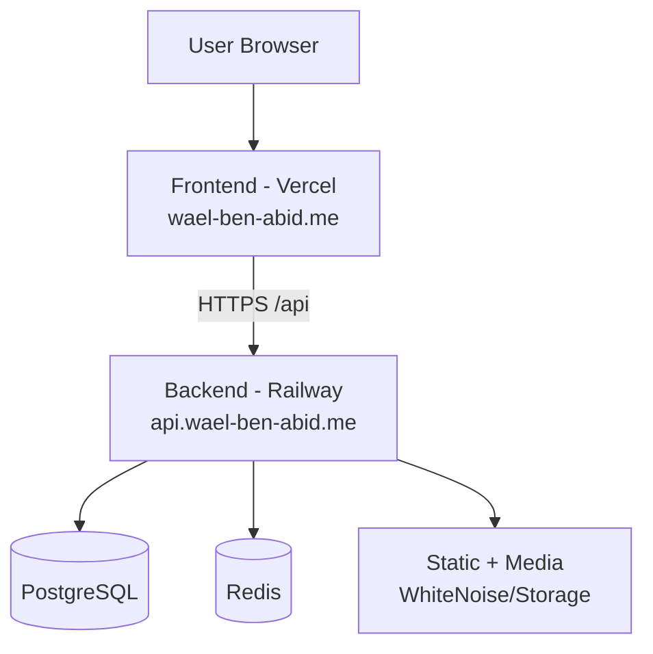

# Portfolio v1 - Django + React Production Deployment

Full-stack portfolio platform with Django REST API backend and React frontend.
Prepared for production deployment with domain: `wael-ben-abid.me`.

## Architecture



## Project Structure

```text
project-root/
├─ backend/
├─ frontend/
├─ docker/
├─ scripts/
├─ .env.example
├─ docker-compose.yml
└─ README.md
```

## Backend (Django)

### Settings split
- `backend/portfolio/settings/base.py`
- `backend/portfolio/settings/dev.py`
- `backend/portfolio/settings/prod.py`

### Environment-based config
Uses `python-dotenv` + env vars:
- `DJANGO_SECRET_KEY`
- `DJANGO_DEBUG`
- `DJANGO_ALLOWED_HOSTS`
- `DATABASE_URL`
- `CORS_ALLOWED_ORIGINS`
- `CSRF_TRUSTED_ORIGINS`
- `REDIS_URL`

### Production hardening
- WhiteNoise enabled for static files
- Gunicorn config: `backend/gunicorn.conf.py`
- Secure cookies + HSTS + SSL redirect in `prod.py`
- Allowed hosts include:
  - `wael-ben-abid.me`
  - `www.wael-ben-abid.me`
  - `api.wael-ben-abid.me`

## Frontend (React)

### Production build
```bash
cd frontend
npm ci
npm run build
```

### API URL config
Set in `frontend/.env.production`:
- `VITE_API_URL=https://api.wael-ben-abid.me/api`

Build output is `frontend/dist` (ready for Vercel or Nginx).

## Local Setup

### 1) Backend
```bash
cd backend
python -m venv .venv
# activate venv
pip install -r requirements.txt
python manage.py migrate
python manage.py runserver
```

### 2) Frontend
```bash
cd frontend
npm ci
npm run dev
```

## Docker Deployment

### Full stack compose (prod template)
File: `docker/docker-compose.prod.yml`

```bash
cd docker
docker compose -f docker-compose.prod.yml --env-file ../.env up --build -d
```

## CI/CD

GitHub Actions workflows:
- `.github/workflows/production-ci.yml`
- Existing pipeline: `.github/workflows/ci-cd.yml`

Production CI includes:
- install dependencies
- backend tests
- frontend lint
- frontend build

## Deployment Scripts

### Railway (backend)
```bash
bash scripts/deploy_railway.sh
```

### Vercel (frontend)
```bash
bash scripts/deploy_vercel.sh
```

## Domain & DNS Setup (`wael-ben-abid.me`)

### Frontend on Vercel
1. Add domain `wael-ben-abid.me` in Vercel project settings.
2. Add DNS records in your registrar:
- `A` record: `@` -> `76.76.21.21`
- `CNAME` record: `www` -> `cname.vercel-dns.com`

### Backend on Railway
Option A (recommended): backend subdomain
- `CNAME` record: `api` -> `<your-railway-domain>`
- Set backend public URL to `https://api.wael-ben-abid.me`

Option B:
- Use Railway generated URL directly and set `VITE_API_URL` to it.

## Required Environment Variables

Copy `.env.example` to `.env` and fill production values.

Important:
- `DJANGO_SECRET_KEY`: strong random secret
- `DATABASE_URL`: managed PostgreSQL URL
- `DJANGO_ALLOWED_HOSTS`: include your domain(s)
- `CORS_ALLOWED_ORIGINS`: include frontend domain(s)
- `CSRF_TRUSTED_ORIGINS`: include HTTPS frontend/backend origins

## Health Check

Backend health endpoint:
- `GET /health/`

Use for Railway health checks and uptime monitoring.

## Notes for Railway + Vercel

- Backend (Railway): deploy from `backend/`.
- Frontend (Vercel): deploy from `frontend/`.
- Ensure CORS + CSRF env vars are set for both apex and `www` domains.
- Ensure SSL is enabled (automatic on both Railway and Vercel).
